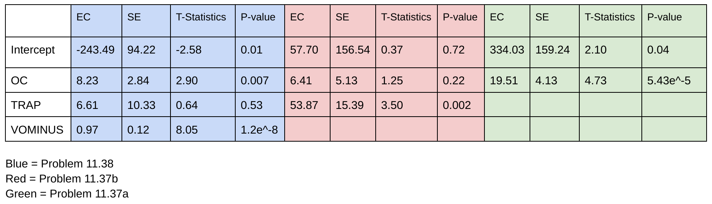

---

```{r, echo = FALSE}
library(readxl)
biomark <- read_excel("Biomark.xls")
```

### Problem 11.36

##### Problem 11.36a

```{r, figures-sode, fig.show = "hold", out.width = "40%", echo = FALSE}
plot(density(biomark$voplus), main = "VO+")
plot(density(biomark$vominus), main = "VO-")
plot(density(biomark$oc), main = "OC")
plot(density(biomark$trap), main = "TRAP")
```

```{r, echo = FALSE}
sd_vo_p = sd(biomark$voplus)
sd_vo_m = sd(biomark$vominus)
sd_oc = sd(biomark$oc)
sd_trap = sd(biomark$trap)
```


Numerical summary for VO+:

```{r}
summary(biomark$voplus)
```

$s_{VO+}=`r sd_vo_p`$

\

Numerical summary for VO-:

```{r}
summary(biomark$vominus)
```

$s_{VO-}=`r sd_vo_m`$

\

Numerical summary for OC:

```{r}
summary(biomark$oc)
```

$s_{OC}=`r sd_oc`$

\

Numerical summary for TRAP:

```{r}
summary(biomark$trap)
```

$s_{TRAP}=`r sd_trap`$

\

Graphical summary for all and the distribution: **Right skewed.**

\

##### Problem 11.36b

**Numerical summary:**

```{r, echo = FALSE}
smallcs = subset(biomark, select = c("voplus", "vominus", "oc", "trap"))
with(biomark, cor(smallcs))
```

\

**Graphical Summary:**

```{r}
pairs(smallcs, pch = ".")
```

**All pairs exhibit a linear and positive association with varying strength as determined by their correlation numbers.**

### Problem 11.37
##### Problem 11.37a
```{r}
fm1 = lm(voplus ~ oc, data = biomark)
summary(fm1)

qqnorm(residuals.lm(fm1))
abline(0,400)
```

**The plot of residuals against OC is sightly curved.**

\

##### Problem 11.37b

```{r}
fm2 = lm(voplus ~ oc + trap, data = biomark)
summary(fm2)
```

**The view that TRAP is a better predictor of bone formation than OC is consistent with the results from 11.36 as the p-value for TRAP is signifiicantly lower than the p-value for OC.**

\

### Problem 11.38

##### Problem 11.38a

$y_{i} = \beta_0 + \beta_1x_{i1} + \beta_2x_{i2} + \beta_3x_{i1} + \epsilon_i$ 

**Assumption:** $\epsilon_i$ is assumed to be independent and $N(0, \sigma$)

##### Problem 11.38b

```{r}
fm3 = lm(voplus ~ oc + trap + vominus, data = biomark)
summary(fm3)
```

\

##### Problem 11.38c




